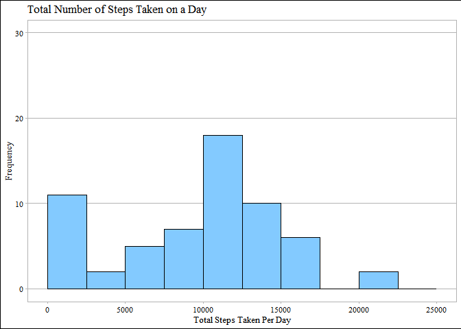
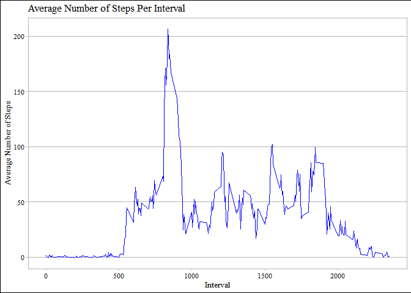
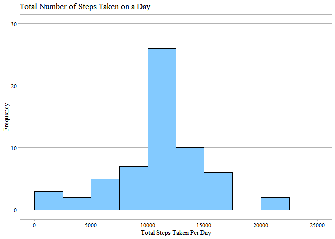
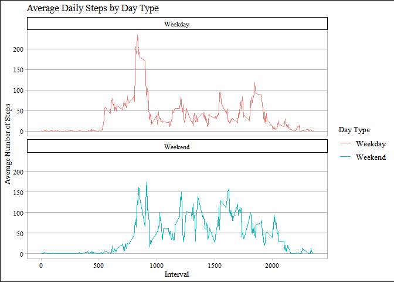

## Introduction

It is now possible to collect a large amount of data about personal movement using activity monitoring devices such as a Fitbit, Nike Fuelband, or Jawbone Up. These type of devices are part of the “quantified self” movement – a group of enthusiasts who take measurements about themselves regularly to improve their health, to find patterns in their behavior, or because they are tech geeks. But these data remain under-utilized both because the raw data are hard to obtain and there is a lack of statistical methods and software for processing and interpreting the data.

This assignment makes use of data from a personal activity monitoring device. This device collects data at 5 minute intervals through out the day. The data consists of two months of data from an anonymous individual collected during the months of October and November, 2012 and include the number of steps taken in 5 minute intervals each day.

The variables included in this dataset are:

- steps: Number of steps taking in a 5-minute interval (missing values are coded as NA)
- date: The date on which the measurement was taken in YYYY-MM-DD format
- interval: Identifier for the 5-minute interval in which measurement was taken

The dataset is stored in a comma-separated-value (CSV) file and there are a total of 17,568 observations in this dataset.

## Assignment

This assignment will be described in multiple parts. You will need to write a report that answers the questions detailed below. Ultimately, you will need to complete the entire assignment in a single R markdown document that can be processed by knitr and be transformed into an HTML file.

Throughout your report make sure you always include the code that you used to generate the output you present. When writing code chunks in the R markdown document, always use echo = TRUE so that someone else will be able to read the code. This assignment will be evaluated via peer assessment so it is essential that your peer evaluators be able to review the code for your analysis.

For the plotting aspects of this assignment, feel free to use any plotting system in R (i.e., base, lattice, ggplot2)

Fork/clone the GitHub repository created for this assignment. You will submit this assignment by pushing your completed files into your forked repository on GitHub. The assignment submission will consist of the URL to your GitHub repository and the SHA-1 commit ID for your repository state.

Questions to be answered:

- What is mean total number of steps taken per day?
- What is the average daily activity pattern?
- Imputing missing values
- Are there differences in activity patterns between weekdays and weekends?

# Setting Global Options 


```r
knitr::opts_chunk$set(echo = TRUE, warning = FALSE, fig.width = 10, fig.height = 5,
                      fig.keep = 'all', fig.path = 'figures\ ', dev = 'png')
```

# Loading and Pre-Processing Data


```r
# Loading packages
library(ggplot2)
library(ggthemes)

# Unzipping the file and reading it
path = getwd()
unzip("repdata_data_activity.zip", exdir = path)

activity <- read.csv("activity.csv")

# Setting date format to help get the weekdays of the dates
activity$date <- as.POSIXct(activity$date, "%Y%m%d")

# Getting the days of all the dates on the dataset
day <- weekdays(activity$date)

# Combining the dataset with the weekday of the dates
activity <- cbind(activity, day)

# Viewing the processed data
summary(activity)
```

```
##      steps             date               interval          day           
##  Min.   :  0.00   Min.   :2012-10-01   Min.   :   0.0   Length:17568      
##  1st Qu.:  0.00   1st Qu.:2012-10-16   1st Qu.: 588.8   Class :character  
##  Median :  0.00   Median :2012-10-31   Median :1177.5   Mode  :character  
##  Mean   : 37.38   Mean   :2012-10-31   Mean   :1177.5                     
##  3rd Qu.: 12.00   3rd Qu.:2012-11-15   3rd Qu.:1766.2                     
##  Max.   :806.00   Max.   :2012-11-30   Max.   :2355.0                     
##  NA's   :2304
```

--------------------------------------------------------------------------------------------------------------------

# Question 1 - What is the mean total number of steps taken per day?


```r
# Calculating total steps taken on a day
activityTotalSteps <- with(activity, aggregate(steps, by = list(date), sum, na.rm = TRUE))
# Changing col names
names(activityTotalSteps) <- c("Date", "Steps")

# Converting the data set into a data frame to be able to use ggplot2
totalStepsdf <- data.frame(activityTotalSteps)

# Plotting a histogram using ggplot2
g <- ggplot(totalStepsdf, aes(x = Steps)) + 
  geom_histogram(breaks = seq(0, 25000, by = 2500), fill = "#83CAFF", col = "black") + 
  ylim(0, 30) + 
  xlab("Total Steps Taken Per Day") + 
  ylab("Frequency") + 
  ggtitle("Total Number of Steps Taken on a Day") + 
  theme_calc(base_family = "serif")

print(g)
```



The mean of the total number of steps taken per day is:


```r
mean(activityTotalSteps$Steps)
```

```
## [1] 9354.23
```

The median of the total number of steps taken per day is:


```r
median(activityTotalSteps$Steps)
```

```
## [1] 10395
```

-----------------------------------------------------------------------------------------------------------------

# Question 2 - What is the average daily activity pattern?


```r
# Calculating the average number of steps taken, averaged across all days by 5-min intervals.
averageDailyActivity <- aggregate(activity$steps, by = list(activity$interval), 
                                  FUN = mean, na.rm = TRUE)
# Changing col names
names(averageDailyActivity) <- c("Interval", "Mean")

# Converting the data set into a dataframe
averageActivitydf <- data.frame(averageDailyActivity)

# Plotting on ggplot2
da <- ggplot(averageActivitydf, mapping = aes(Interval, Mean)) + 
  geom_line(col = "blue") +
  xlab("Interval") + 
  ylab("Average Number of Steps") + 
  ggtitle("Average Number of Steps Per Interval") +
  theme_calc(base_family = "serif")
  
print(da)
```



Which 5-minute interval, on average across all the days in the dataset, contains the maximum number of steps?


```r
averageDailyActivity[which.max(averageDailyActivity$Mean), ]$Interval
```

```
## [1] 835
```

-------------------------------------------------------------------------------------------------------------------

# Question 3 - Imputing Missing Values

Calculate and report the total number of missing values in the dataset (i.e. the total number of rows with NAs.

```r
sum(is.na(activity$steps))
```

```
## [1] 2304
```

Devise a strategy for filling in all of the missing values in the dataset. The strategy does not need to be sophisticated. For example, you could use the mean/median for that day, or the mean for that 5-minute interval, etc.


```r
# Matching the mean of daily activity with the missing values
imputedSteps <- averageDailyActivity$Mean[match(activity$interval, averageDailyActivity$Interval)]
```

Create a new dataset that is equal to the original dataset but with the missing data filled in.


```r
# Transforming steps in activity if they were missing values with the filled values from above.
activityImputed <- transform(activity, 
                             steps = ifelse(is.na(activity$steps), yes = imputedSteps, no = activity$steps))

# Forming the new dataset with the imputed missing values.
totalActivityImputed <- aggregate(steps ~ date, activityImputed, sum)

# Changing col names
names(totalActivityImputed) <- c("date", "dailySteps")
```

Testing the new dataset to check if it still has any missing values -


```r
sum(is.na(totalActivityImputed$dailySteps))
```

```
## [1] 0
```

Make a histogram of the total number of steps taken each day and Calculate and report the mean and median total number of steps taken per day. Do these values differ from the estimates from the first part of the assignment? What is the impact of imputing missing data on the estimates of the total daily number of steps?


```r
# Converting the data set into a data frame to be able to use ggplot2
totalImputedStepsdf <- data.frame(totalActivityImputed)

# Plotting a histogram using ggplot2
p <- ggplot(totalImputedStepsdf, aes(x = dailySteps)) + 
  geom_histogram(breaks = seq(0, 25000, by = 2500), fill = "#83CAFF", col = "black") + 
  ylim(0, 30) + 
  xlab("Total Steps Taken Per Day") + 
  ylab("Frequency") + 
  ggtitle("Total Number of Steps Taken on a Day") + 
  theme_calc(base_family = "serif")

print(p)
```



The mean of the total number of steps taken per day is:


```r
mean(totalActivityImputed$dailySteps)
```

```
## [1] 10766.19
```

The median of the total number of steps taken per day is:


```r
median(totalActivityImputed$dailySteps)
```

```
## [1] 10766.19
```

--------------------------------------------------------------------------------------------------------------------

# Question 4 - Are there differences in activity patterns between weekdays and weekends?

Create a new factor variable in the dataset with two levels – “weekday” and “weekend” indicating whether a given date is a weekday or weekend day.


```r
# Updating format of the dates
activity$date <- as.Date(strptime(activity$date, format="%Y-%m-%d"))

# Creating a function that distinguises weekdays from weekends
activity$dayType <- sapply(activity$date, function(x) {
  if(weekdays(x) == "Saturday" | weekdays(x) == "Sunday")
  {y <- "Weekend"}
  else {y <- "Weekday"}
  y
})
```

Make a panel plot containing a time series plot (i.e. type = “l”) of the 5-minute interval (x-axis) and the average number of steps taken, averaged across all weekday days or weekend days (y-axis). See the README file in the GitHub repository to see an example of what this plot should look like using simulated data.


```r
# Creating the data set that will be plotted
activityByDay <-  aggregate(steps ~ interval + dayType, activity, mean, na.rm = TRUE)

# Plotting using ggplot2
dayPlot <-  ggplot(activityByDay, aes(x = interval , y = steps, color = dayType)) + 
  geom_line() + ggtitle("Average Daily Steps by Day Type") + 
  xlab("Interval") + 
  ylab("Average Number of Steps") +
  facet_wrap(~dayType, ncol = 1, nrow=2) +
  scale_color_discrete(name = "Day Type") +
  theme_calc(base_family = "serif")

print(dayPlot) 
```



-------------------------------------------------------------------------------------------------------
